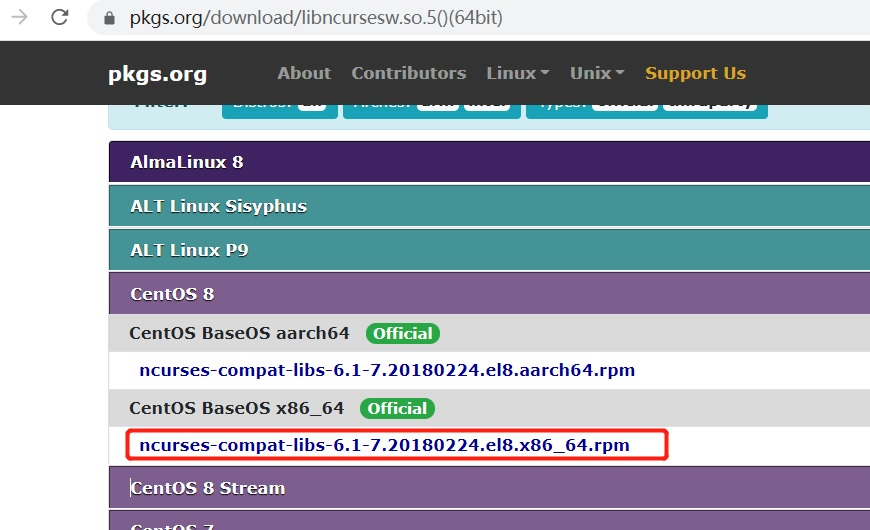

# 单机版安装及用户创建

## 一、安装

### 1.1、环境准备

| 操作系统   | MySQL |                                     CPU | 内存 |
| ---------- | ----: | --------------------------------------: | :--: |
| Contos 8.1 |   5.7 | Intel(R) Core(TM) i5-7400 CPU @ 3.00GHz |  1G  |

### 1.2、安装

Step1、创建目录 /opt/mysql

Step2、获取MySQL5.7安装文件# wget http://dev.mysql.com/get/mysql-5.7.26-1.el7.x86_64.rpm-bundle.tar

Step3、# chmod 755  mysql-5.7.26-1.el7.x86_64.rpm-bundle.tar

Step4、# tar -zxvf mysql-5.7.26-1.el7.x86_64.rpm-bundle.tar

Step5、运行rpm -qa|grep mari，查询mariadb相关安装包,如果有运行rpm -e --nodeps mariadb-libs，卸载他

Step6、安装各rpm安装包

```she
# rpm -ivh mysql-community-common-5.7.26-1.el7.x86_64.rpm
# rpm -ivh mysql-community-libs-5.7.26-1.el7.x86_64.rpm
# rpm -ivh mysql-community-client-5.7.26-1.el7.x86_64.rpm
# rpm -ivh mysql-community-server-5.7.26-1.el7.x86_64.rpm
```

> 此步骤有报错:

> 在安装mysql-community-client时报依赖Libncursesw.so.5()(64bit)缺失异常。

> 解决办法：

> 下载Libncursesw.so.5()(64bit)，地址：https://centos.pkgs.org/8/centos-baseos-x86_64/ncurses-compat-libs-6.1-7.20180224.el8.x86_64.rpm.html

>  
>
> 或者使用 # yum install libncurses* 进行安装所有的依赖包

Step7、启动MySQL

```shell
# systemctl start mysqld.service
```

Step8、查看当前自动产生的root密码，运行如下命令

```shell
# grep "password" /var/log/mysqld.log
```

得到的临时密码如下：

```sh
2021-06-22T08:06:45.449601Z 1 [Note] A temporary password is generated for root@localhost: hXXZ&e7)5ca)
```

其中<u>**hXXZ&e7)5ca)**</u> 为自动生成的密码，下一步需要修改，不然后面不让操作相关的命令

Step9、使用自动生成的密码连接并登录mysql

```she
# mysql -u root –p
```

Step10、修改强密码设置为弱密码策略

```sh
mysql> set global validate_password_policy=0;
```

> 默认为强密码策略，validate_password_policy默认值1

Step11、修改root的密码

```sh
mysql> set password for 'root'@'localhost'=password('6666');
```

或者

```sh
mysql> ALTER USER 'root'@'localhost' IDENTIFIED BY '6666';
```

Step12、刷新，使修改生效

```sh
mysql> flush privileges;
```

Step13、创建新用户并赋予管理员权限

```sh
mysql> create user 'stu'@'10.105.22.86' identified by '6666';
mysql> GRANT ALL PRIVILEGES ON *.* TO 'stu'@'%' IDENTIFIED BY '6666' WITH GRANT OPTION;
```

```sh
说明:stu表示账号，6666表示密码,*.*表示所有数据库上,%表示所有IP上
```

Step14、至此完工。